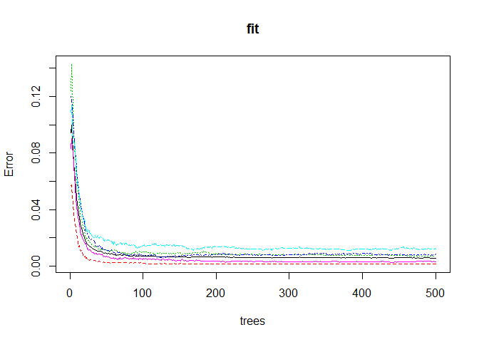

## Abstract

In this report, we detail a prediction model for the quality of weight lifting exercises, developed using the Weight Lifting Exercises Dataset (http://web.archive.org/web/20161224072740/http:/groupware.les.inf.puc-rio.br/har). First, we describe the WLE data. Then, we detail the data pre-processing, feature selection, model construction, and expected out of sample error.

## Weight Lifting Exercises Dataset

The WLE data set contains various on-body sensor measurements for 6 participants that were asked to perform one set of 10 repetitions of the Unilateral Dumbbell Biceps Curl in 5 different fashions: exactly according to the specification (Class A) and 4 common mistakes (Classes B, C, D, and E).


```r
## complete training dataset
training <- read.csv("https://d396qusza40orc.cloudfront.net/predmachlearn/pml-training.csv")
str(training, list.len = 10) ## show only the first 10 variables
```

```
## 'data.frame':	19622 obs. of  160 variables:
##  $ X                       : int  1 2 3 4 5 6 7 8 9 10 ...
##  $ user_name               : Factor w/ 6 levels "adelmo","carlitos",..: 2 2 2 2 2 2 2 2 2 2 ...
##  $ raw_timestamp_part_1    : int  1323084231 1323084231 1323084231 1323084232 1323084232 1323084232 1323084232 1323084232 1323084232 1323084232 ...
##  $ raw_timestamp_part_2    : int  788290 808298 820366 120339 196328 304277 368296 440390 484323 484434 ...
##  $ cvtd_timestamp          : Factor w/ 20 levels "02/12/2011 13:32",..: 9 9 9 9 9 9 9 9 9 9 ...
##  $ new_window              : Factor w/ 2 levels "no","yes": 1 1 1 1 1 1 1 1 1 1 ...
##  $ num_window              : int  11 11 11 12 12 12 12 12 12 12 ...
##  $ roll_belt               : num  1.41 1.41 1.42 1.48 1.48 1.45 1.42 1.42 1.43 1.45 ...
##  $ pitch_belt              : num  8.07 8.07 8.07 8.05 8.07 8.06 8.09 8.13 8.16 8.17 ...
##  $ yaw_belt                : num  -94.4 -94.4 -94.4 -94.4 -94.4 -94.4 -94.4 -94.4 -94.4 -94.4 ...
##   [list output truncated]
```

`classe` is the variable denoting the target exercise class (`A`, `B`, `C`, `D`, and `E`).

## Initial Data Pre-Processing

This data set includes 159 variables that can be used to predict the `classe` value. Some of these are removed prior to building the machine learning model. 

A brief analysis of the `new_window` and `num_window` variables showed that the number of measurements for each window is inconsistent. Not all windows have a `new_window == yes`. For this reason, these two variables are removed.


```r
head(table(training$num_window,training$new_window))
```

```
##    
##     no yes
##   1 20   0
##   2 20   1
##   3  3   0
##   4 28   0
##   5 20   1
##   6 20   1
```

Furthermore, by relying on the `user_name` information, the models would become applicable only to these 6 users. This information is removed as well. The `X` and timestamp columns are removed as well.


```r
## removing unwanted columns:
toRemove <- c("X", "user_name", "raw_timestamp_part_1", "raw_timestamp_part_2", "cvtd_timestamp", "new_window", "num_window")
training<-training[, !(names(training) %in% toRemove)]
```

## Feature Selection

In addition to direct measurements from the sensors attached to various parts of the body (belt, arm, forearm, and dumbell), the data includes `min_`, `max_`, `avg_`, `var_`, `stddev_`, `total_` values derived from the others. For this reason, we remove all variables that have no variablity within our training set.


```r
library(caret)
```

```
## Loading required package: lattice
```

```
## Loading required package: ggplot2
```

```r
## identify features that have no variability
nzVar <- nearZeroVar(training, saveMetrics=TRUE)
# keep only those with nzv == FALSE
toKeep <- row.names(nzVar[nzVar$nzv == FALSE,])
training<-training[, (names(training) %in% toKeep)]
str(training, list.len = 10)
```

```
## 'data.frame':	19622 obs. of  94 variables:
##  $ roll_belt               : num  1.41 1.41 1.42 1.48 1.48 1.45 1.42 1.42 1.43 1.45 ...
##  $ pitch_belt              : num  8.07 8.07 8.07 8.05 8.07 8.06 8.09 8.13 8.16 8.17 ...
##  $ yaw_belt                : num  -94.4 -94.4 -94.4 -94.4 -94.4 -94.4 -94.4 -94.4 -94.4 -94.4 ...
##  $ total_accel_belt        : int  3 3 3 3 3 3 3 3 3 3 ...
##  $ max_roll_belt           : num  NA NA NA NA NA NA NA NA NA NA ...
##  $ max_picth_belt          : int  NA NA NA NA NA NA NA NA NA NA ...
##  $ min_roll_belt           : num  NA NA NA NA NA NA NA NA NA NA ...
##  $ min_pitch_belt          : int  NA NA NA NA NA NA NA NA NA NA ...
##  $ amplitude_roll_belt     : num  NA NA NA NA NA NA NA NA NA NA ...
##  $ amplitude_pitch_belt    : int  NA NA NA NA NA NA NA NA NA NA ...
##   [list output truncated]
```

NOTE: `nearZeroVar()` does not eliminate all these variable. However, it reduces the dimensionality of the data.

## Data Pre-Processing

The training data includes many missing values for various measurements. We estimate these values using the k nearest neighbors imputation, since most learning algorithms cannot handle missing values.


```r
set.seed(2018-5-13)
## preProcessing object to handle missing data (94th column is classe)
preObj <- preProcess(training[,-94], method = "knnImpute")
trainingPP <- predict(preObj, training[,-94])
str(trainingPP, list.len = 10)
```

```
## 'data.frame':	19622 obs. of  93 variables:
##  $ roll_belt               : num  -1 -1 -1 -1 -1 ...
##  $ pitch_belt              : num  0.347 0.347 0.347 0.347 0.347 ...
##  $ yaw_belt                : num  -0.874 -0.874 -0.874 -0.874 -0.874 ...
##  $ total_accel_belt        : num  -1.07 -1.07 -1.07 -1.07 -1.07 ...
##  $ max_roll_belt           : num  -0.898 -0.898 -0.898 -0.898 -0.898 ...
##  $ max_picth_belt          : num  -1.14 -1.14 -1.14 -1.14 -1.14 ...
##  $ min_roll_belt           : num  -0.869 -0.869 -0.869 -0.869 -0.869 ...
##  $ min_pitch_belt          : num  -0.985 -0.985 -0.985 -0.985 -0.985 ...
##  $ amplitude_roll_belt     : num  -0.143 -0.143 -0.143 -0.143 -0.143 ...
##  $ amplitude_pitch_belt    : num  -0.748 -0.748 -0.748 -0.748 -0.748 ...
##   [list output truncated]
```

## Model Construction

For this prediction task, we use the *random forest* framework to build a model that predicts that `classe` variable from all other variables of the pre-processed training data. Random forest is one of the most used/accurate algorithms.


```r
library(randomForest)
```

```
## randomForest 4.6-14
```

```
## Type rfNews() to see new features/changes/bug fixes.
```

```
## 
## Attaching package: 'randomForest'
```

```
## The following object is masked from 'package:ggplot2':
## 
##     margin
```

```r
fit <- randomForest(training$classe ~ ., data = trainingPP)
fit
```

```
## 
## Call:
##  randomForest(formula = training$classe ~ ., data = trainingPP) 
##                Type of random forest: classification
##                      Number of trees: 500
## No. of variables tried at each split: 9
## 
##         OOB estimate of  error rate: 0.57%
## Confusion matrix:
##      A    B    C    D    E class.error
## A 5573    3    1    1    2 0.001254480
## B   15 3771   11    0    0 0.006847511
## C    1   18 3393    8    2 0.008474576
## D    1    0   34 3177    4 0.012126866
## E    0    2    3    6 3596 0.003049626
```

### Expected Out-of-Sample Error

The model's OOB estimate of error rate is 0.57% (as shown above). The error rate plot is shown below.


```r
plot(fit)
```

<!-- -->

## Testing Data Predictions

We apply the same data pre-processing operations to the testing data set as well and retrieve the predicted `classe` values.


```r
# load testing data
testing <- read.csv("https://d396qusza40orc.cloudfront.net/predmachlearn/pml-testing.csv")
# apply the pre-processing done for training
testing <- testing[, (names(testing) %in% toKeep)]
str(testing, list.len = 10) ## reduced to 93 variables
```

```
## 'data.frame':	20 obs. of  93 variables:
##  $ roll_belt               : num  123 1.02 0.87 125 1.35 -5.92 1.2 0.43 0.93 114 ...
##  $ pitch_belt              : num  27 4.87 1.82 -41.6 3.33 1.59 4.44 4.15 6.72 22.4 ...
##  $ yaw_belt                : num  -4.75 -88.9 -88.5 162 -88.6 -87.7 -87.3 -88.5 -93.7 -13.1 ...
##  $ total_accel_belt        : int  20 4 5 17 3 4 4 4 4 18 ...
##  $ max_roll_belt           : logi  NA NA NA NA NA NA ...
##  $ max_picth_belt          : logi  NA NA NA NA NA NA ...
##  $ min_roll_belt           : logi  NA NA NA NA NA NA ...
##  $ min_pitch_belt          : logi  NA NA NA NA NA NA ...
##  $ amplitude_roll_belt     : logi  NA NA NA NA NA NA ...
##  $ amplitude_pitch_belt    : logi  NA NA NA NA NA NA ...
##   [list output truncated]
```

```r
testingPP <- predict(preObj, testing)
str(testingPP, list.len = 10) ## no missing values
```

```
## 'data.frame':	20 obs. of  93 variables:
##  $ roll_belt               : num  0.934 -1.01 -1.013 0.966 -1.005 ...
##  $ pitch_belt              : num  1.1943 0.2042 0.0678 -1.8749 0.1353 ...
##  $ yaw_belt                : num  0.0678 -0.8162 -0.812 1.8195 -0.813 ...
##  $ total_accel_belt        : num  1.122 -0.944 -0.815 0.735 -1.074 ...
##  $ max_roll_belt           : num  0.0367 -0.8581 -0.8573 1.8275 -0.8632 ...
##  $ max_picth_belt          : num  0.909 -0.99 -0.99 0.584 -1.215 ...
##  $ min_roll_belt           : num  0.0504 -0.8315 -0.8298 1.859 -0.8362 ...
##  $ min_pitch_belt          : num  1.023 -0.985 -0.931 0.836 -1.172 ...
##  $ amplitude_roll_belt     : num  -0.049 -0.1318 -0.135 -0.0463 -0.1334 ...
##  $ amplitude_pitch_belt    : num  -0.156 -0.24 -0.41 -0.664 -0.41 ...
##   [list output truncated]
```

```r
# predict `classe` values
predict(fit, testingPP)
```

```
##  1  2  3  4  5  6  7  8  9 10 11 12 13 14 15 16 17 18 19 20 
##  B  A  B  A  A  E  D  B  A  A  B  C  B  A  E  E  A  B  B  B 
## Levels: A B C D E
```
